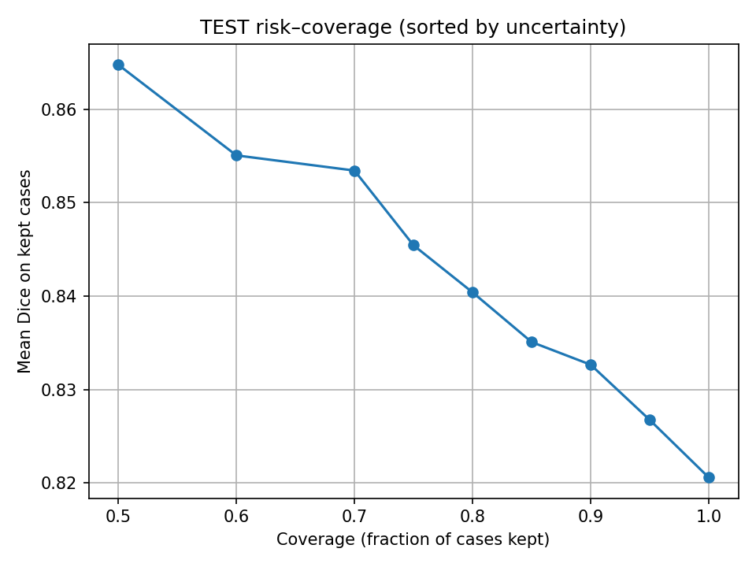
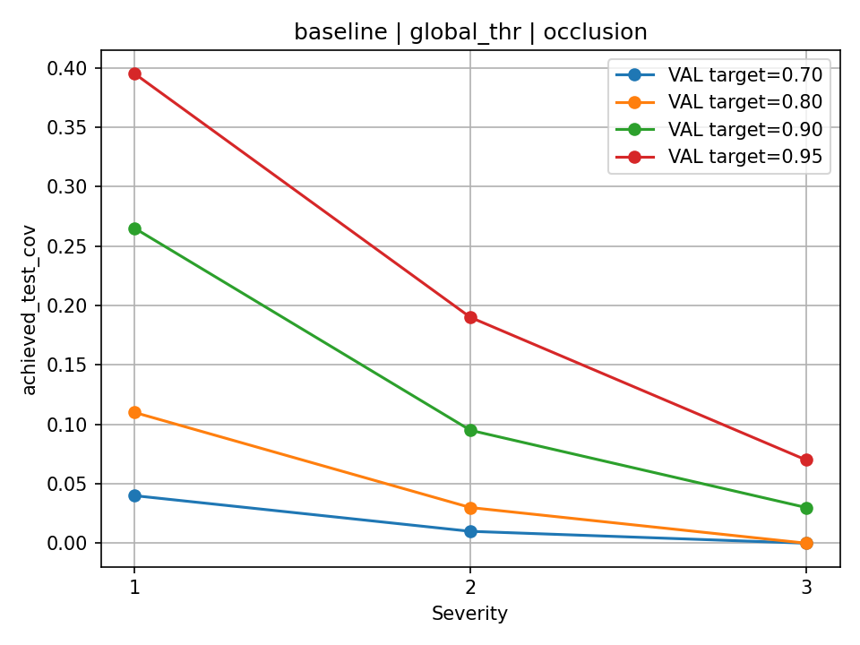
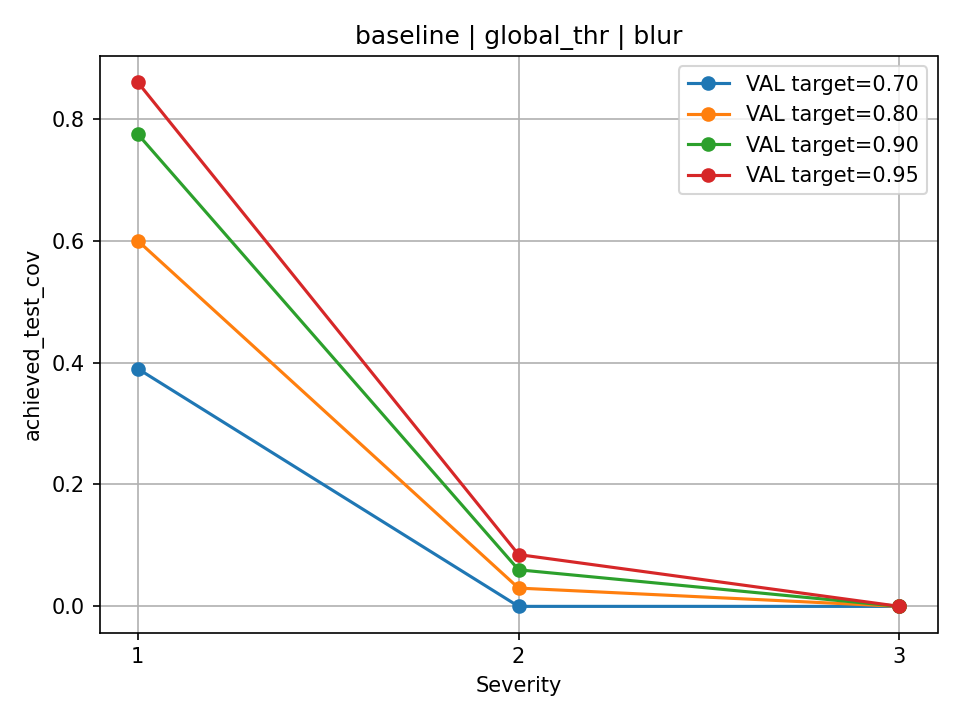
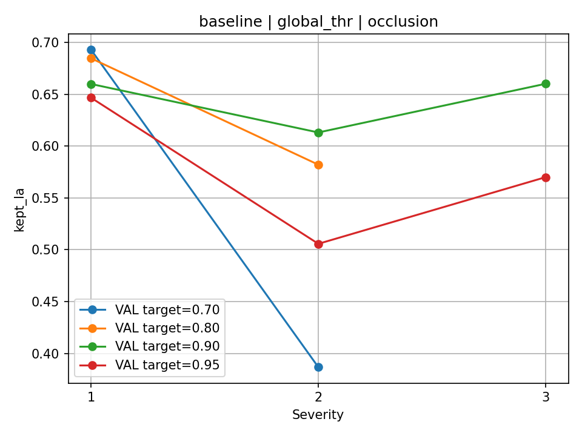
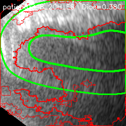
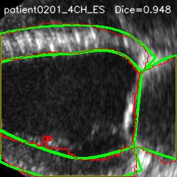

# 🔬 CAMUS Reliability-Aware Segmentation

Reliability-aware cardiac ultrasound segmentation with uncertainty-based selective prediction and calibration robustness analysis on the CAMUS dataset.

---

## Overview

Cardiac ultrasound segmentation models are typically evaluated using average Dice scores under clean test conditions. However, real-world ultrasound data often exhibits degradation such as noise, blur, and occlusion. Under such distribution shifts:

- Segmentation quality may degrade.
- Confidence thresholds calibrated on clean validation data may collapse.
- Deployment reliability becomes unpredictable.

This project investigates:

- Entropy-based uncertainty for segmentation reliability.
- Selective segmentation (accept/abstain policies).
- Threshold transfer under distribution shift.
- Calibration gap analysis.
- Robustness trade-offs across training variants.

The study is performed on the CAMUS cardiac ultrasound dataset using PyTorch + MONAI.

---

## Key Contributions

- Reproducible U-Net segmentation baseline for LV / MYO / LA.
- Entropy-based uncertainty score correlated with segmentation error.
- Risk–coverage and failure detection evaluation.
- Threshold-transfer robustness study under realistic corruptions:
  - Gaussian noise
  - Blur
  - Occlusion
  - Contrast shift
  - Gain shift
- Calibration gap analysis (coverage collapse under shift).
- Comparison of training variants:
  - Baseline
  - LA-weighted loss
  - Noise-augmented training

---

## Repository Structure

src/        → Training, evaluation, robustness & calibration scripts  
results/    → CSV outputs (risk-coverage, threshold sweeps, calibration gaps)  
figures/    → Key plots and qualitative examples  

---

## Segmentation Setup

- Framework: PyTorch + MONAI
- Model: 2D U-Net
- Input shape: (1, H, W) grayscale ultrasound
- Classes:
  - 0: Background
  - 1: LV
  - 2: MYO
  - 3: LA
- Metrics:
  - Dice
  - HD95
- Data splits:
  - Train / Validation / Test (patient-level separation)

---

## Training Environment

Experiments were conducted with the following setup:

- **Python:** 3.10.19  
- **PyTorch:** 2.5.1+cu121  
- **MONAI:** 1.x  
- **CUDA (Torch build):** 12.1  
- **GPU:** NVIDIA GeForce MX350  
- **NVIDIA Driver:** 555.42.06  
- **OS:** Linux 6.8.0-106-generic

---

### Training Time

Baseline U-Net training required approximately **~4 hours per model** on NVIDIA MX350.  
LA-weighted and noise-augmented variants required similar training time.

Robustness and evaluation scripts were executed on GPU; CPU execution is possible but significantly slower.

---

## Uncertainty & Selective Prediction

Uncertainty is computed using softmax entropy:

- Low entropy → confident prediction  
- High entropy → uncertain prediction  

Selective segmentation policies:
- Global thresholding (calibrated on clean validation)
- Group-conditioned thresholds (view/phase)
- Fixed-budget selection (Top-K%)

---

## Robustness Evaluation

Corruptions applied to test images:

- Gaussian noise
- Gaussian blur
- Random occlusion
- Contrast scaling
- Gain perturbation

For each corruption and severity:
- Measure Dice degradation
- Compute achieved coverage under fixed validation thresholds
- Compute calibration gap:

gap = target_coverage − achieved_coverage

Large gaps indicate coverage collapse under distribution shift.

---

## Example Results

### Risk–Coverage Curve (Clean Test)

### Coverage Collapse under Occlusion

### Coverage Collapse under Blur

### Accepted-Case LA Quality under Occlusion

### Qualitative Examples

Worst Case:

Best Case:

---

## Reproducibility

Install dependencies:

pip install -r requirements.txt

Train baseline model:

python src/train_camus_nifti_unet.py

Compute uncertainty & risk-coverage:

python src/step1_entropy_reliability.py

Run robustness evaluation:

python src/robust_selective_eval.py

Compute calibration gap summary:

python src/merge_gap_summaries.py

---

## Key Findings

- Entropy strongly correlates with segmentation failure.
- Selective prediction significantly improves accepted-case Dice.
- Thresholds calibrated on clean validation collapse under blur and occlusion.
- Training variants shift robustness regimes (noise vs occlusion trade-offs).
- Fixed-budget selection provides a more stable comparison under shift.

---

## License

This repository contains code only.  
CAMUS dataset is not included and must be obtained separately.

